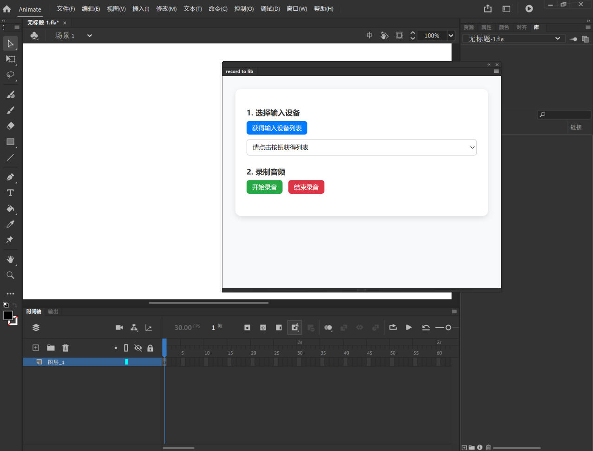

# Adobe Animate 插件：录音导入库（record to lib）

一个用于 Adobe Animate 的 CEP 插件, 支持在 Animate 界面内部执行录音并导入库中.

## 🚀 安装方式

> 仅适用于 Windows 系统!

1. 克隆或下载本项目到本地
2. 将得到的 `adobe-animate-record-to-lib` 文件夹复制到 `C:\Program Files (x86)\Common Files\Adobe\CEP\extensions` 中
3. 参考[这里](https://github.com/Adobe-CEP/Getting-Started-guides/blob/master/Client-side%20Debugging/readme.md#set-the-debug-mode)开启调试模式
4. 重启 Adobe Animate
5. 在 `窗口 > 扩展 > record to lib` 中打开插件面板

## 🔧 插件功能

### 1. 选择输入设备

点击「获得输入设备列表」, 可查看系统中可用的麦克风或其他音频输入.

### 2. 开始 / 停止录音

- 选择设备后, 点击「开始录音」
- 录制期间会使用内置 FFmpeg 进行采样
- 录音完成后自动导入 `.wav` 文件到当前 Animate 项目的库中
- 完成导入后自动删除临时音频文件

## ⚠️ 注意事项

- 插件目前仅支持 **Windows + Animate 15.0 及以上版本**
- 请确保当前有打开并保存的 `.fla` 项目
- 如果录音未生效, 确认系统已安装音频设备 & FFmpeg 可正常运行
- 面板内通过 `alert` 提示错误信息, 开发者建议在 DevTools 中查看详细日志

## 📜 License

MIT License
